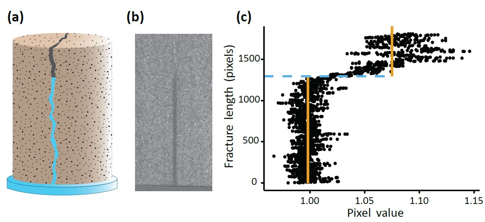
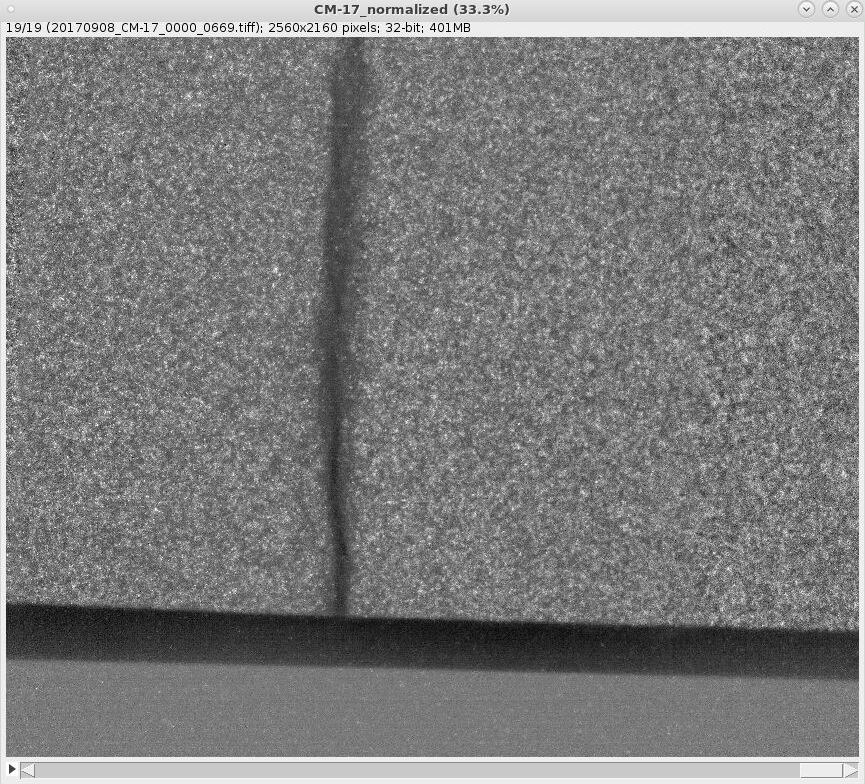
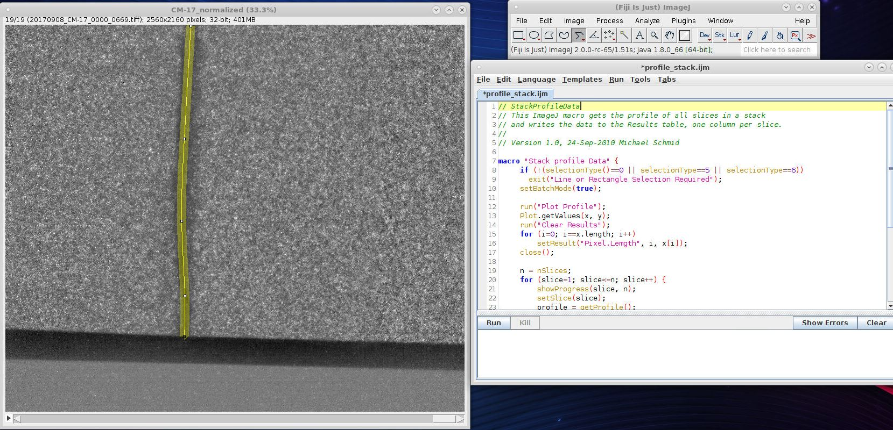
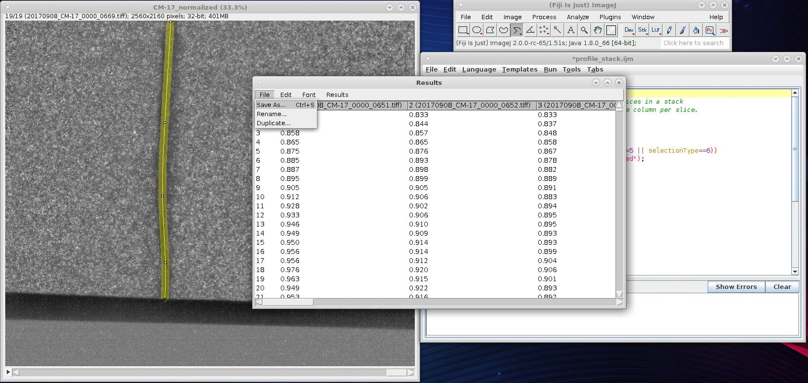

```{r global_options, include=FALSE, fig.align= "center"}
knitr::opts_chunk$set(fig.width=6, fig.height=4, fig.path='figs/',
                      warning=FALSE, message=FALSE)
```

```{r include = FALSE}
library(devtools)
library(knitr)
load_all(pkg = "./../../profilr")
```

#Introduction
The profilr package was created to help analyze stacked image data sets and detect significant changes in the image data, whether at a region of interest (within a box or segmented line) or over the entire image itself. While this package was originally made for analyzing images, it can be used for virtually any changing dataset with time, provided the length of the dataset is constant and that you desire to know the location of the change/changes. The changes within the datasets are detected using change point analysis. See R Killick's R package 'changepoint' and relevent publications (referenced at end of document) for more information about this process. This package merely provides an easy way to implement the changepoint package in a more batch model like way. The profilr package contains two major functions 1) lineprof and 2) imageprof. 

###Delineate the height of fluid wetting within a fracture with respect to time
A recent study of mine required delineating the height of wetting of water with respect to time within a rock fracture. We used neutron radiography to visualize the movement of water within the fractures. This process yielded a stack of neutron radiographs (essentially gray scale TIFFs) that had time stamps associated with each image. It would be an extremely tedious task to manually measure the distance the water had traveled for each individual image. Thus, I created this package to help automate the R Killick's 'changepoint' package to allow changepoint analysis to delineate the height for me. Change point analysis detects significant changes within data. For this study, I wanted to detect significant changes in the pixel values along the path of the fracture in the image. 
<br>
<br>
<br>
```{r echo=FALSE, out.width='100%', fig.cap= "(a) Schematic illustration showing the uptake of water within a fractured core sample soon after basal contact with water. (b) Example of a normalized neutron radiograph showing water (in black) within a fractured Crossville Sandstone core. (c) Change point analysis of the neutron radiograph shown in b. The solid orange lines represent mean pixel values for the wet and dry regions within the fracture. The blue dashed line is the detection point, representing the height of wetting, at which a shift in the mean pixel values occurred"}

```

    

The first step was to obtain the pixel values along the fracture. This was done using the free software ImageJ. I opened the stack of images as an image sequence in ImageJ.
<br>
<br>
<br> 
    
```{r echo=FALSE, out.width='100%', fig.cap= "Neutron radiograph of a limestone core. Black represents water within the fracture. This is an image sequence 19 images in length where water moves through the fracture."}

```
<br>
<br>
<br>
I then drew a segmented line over the pathway of the fracture. It is to be noted that if you increase the width of the drawn line, an average pixel value is given over the width of the line. I then used a macro in ImageJ (ImageJ macro code shown below) to extract the pixel values along the length of the drawn segment for each image in the stack.
<br>
<br>
<br>
```{r echo=FALSE, out.width='100%', fig.cap= "Segmented line drawn in ImageJ with a width of 50 pixels over the fracture. Note that the macro is loaded into ImageJ to extract the pixel values over the transect."}

```
<br>
<br>
<br>
```{r}
print(read.delim("figs/imageprofile_stack.ijm"))
```
<br>
<br>
<br>
You can then save the results of the macro as a .csv file.
<br>
<br>
<br>
```{r echo=FALSE, out.width='100%', fig.cap= "Results window after running the macro on the image sequence. Notice that each column represents the pixel values taken from each consecutive image in the sequence."}

```
<br>
<br>
<br>
By running the macro code, you are prompted to save the results. Doing this, being sure to save as a .csv allows for a dataframe of the picture pixel values over the fracture as shown below. (Note, if you do not use the macro, or are not analyzing image/pixel data, the lineprof function will still work for you. Just be sure to put your data in a similar format as shown below)

```{r}
print(head(limestone[1:5]))
```

Now that I have my pixel data for all images in the stack. I want to see where the significant shifts are for each image (each image is a column of pixel values in the dataframe). Now depending on the type of data I have, I may want to detect significant shifts in the mean, variance, or both the mean and variance. Here, for these images, I want to detect significant shifts in the mean and the variance of the pixel values. With my data in the above format (note that limestone is an included dataset with this package), I can now use the lineprof function to get the changepoints for each image. In my case, I want the significant changes of the mean and variance. So I use the below code.

```{r}
meanvar_results <- lineprof(data = limestone, L_per_pix = 1, type = "meanvar")
print(head(meanvar_results))
```
<br>
<br>
<br>
Say for example, that I knew that the pixel length was 0.0124 mm. I could use this conversion within the function to get my results in mm as shown below.

```{r}
converted_meanvar_results <- lineprof(data = limestone, L_per_pix = 0.0124, type = "meanvar")
print(head(converted_meanvar_results))
```
<br>
<br>
<br>
If I wanted to detect changes in the mean only without converting units, I would use the below code.

```{r}
mean_results <- lineprof(data = limestone, L_per_pix = 1, type = "mean")
print(head(mean_results))
```
<br>
<br>
<br>
If I wanted to detect changes in the variance only without converting units, I would use the below code.

```{r}
var_results <- lineprof(data = limestone, L_per_pix = 1, type = "variance")
print(head(var_results))
```
<br>
<br>
<br>
If I want to compare all of the types of change point analysis, I can simply use type ="all" as shown below.
```{r}
all_results <- lineprof(data = limestone, L_per_pix = 0.0124, type = "all")
print(head(all_results))
```
<br>
<br>
<br>
The great thing is that we can easily plot the results and see the change in wetting height with time.
```{r}
ggplot(data = converted_meanvar_results, aes(x = time.interval, y = unit.length))+
  geom_point()+
  xlab("Time")+
  ylab("Height (mm)")
  
```

### Delineate the height of fluid over an entire image (not just fracture)
Say we now want to understand how fluids move over or along a surface and we want to delineate that moving front with time. This can be difficult as there may be great variation along this interface. This is a great tool for the imageprof function. 

To use this tool, we need to have matrix images (.txt files) portraying the fluid movement saved in a folder. For this example I have generated a fake wetting front shown in these five .txt files.
<br>
<br>
<br>
```{r echo=FALSE, out.width='100%', fig.cap= "Fake generated wetting front 5 images in length. Each image is 8-bit, 200x200 pixels, and is in .txt format"}

```
<br>
<br>
<br>
To visualize the movement of water, and detect the height of wetting at each point across the wetting front, I can use imageprof function as shown below. Here I am using changepoint analysis on each of the images, specifically looking at shifts in the mean and the variance for each column of the matrix as denoted by type = "meanvar". As samplename = NULL the folder name extdata will be used. L_per_pix = 1 so no unit conversion will take place. Lastly, filetail = NULL will give a general automated output ending name of the file. In this case, my saved file would appear as extdata_meanvar.csv in my designated save folder.

```{r}
df <- imageprof(basepath = "./../inst/extdata/", savepath = "./../inst/temp_save_example/", samplename = NULL, L_per_pix = 1, stats = FALSE, type = "meanvar", filetail = NULL)

print(head(df))

```
```{r include = FALSE}
if (file.exists("./../inst/temp_save_example/extdata_meanvar.csv")) file.remove("./../inst/temp_save_example/extdata_meanvar.csv")
```
<br>
<br>
<br>
To override the default samplename and filetail, I can make the following changes resulting in a file saved as myfile_todaysdate.csv in my designated save folder. In this example, say I knew that the pixel length of the images was 0.0124 mm in length. Here I input L_per_pix = 0.0124 and the resulting change points are converted.

```{r}
df <- imageprof(basepath = "./../inst/extdata/", savepath = "./../inst/temp_save_example/", samplename = "myfile", L_per_pix = 0.0124, stats = FALSE, type = "meanvar", filetail = "todaysdate")

print(head(df))

```
```{r include = FALSE}
if (file.exists("./../inst/temp_save_example/myfile_todaysdate.csv")) file.remove("./../inst/temp_save_example/myfile_todaysdate.csv")
```
<br>
<br>
<br>
Perhaps I would like to know the statistics of all of the wetting heights in the image. This can be done by allowing stats = TRUE as shown below. This saves a new file with only the statistics. So here we would have a file saved as wettingfront_meavar_stats.csv in the designated save folder.
```{r}
stats_df <- imageprof(basepath = "./../inst/extdata/", savepath = "./../inst/temp_save_example/", samplename = "wettingfront", L_per_pix = 1, stats = TRUE, type = "meanvar", filetail = NULL)

print(head(stats_df))

```
```{r include = FALSE}
if (file.exists("./../inst/temp_save_example/wettingfront_meanvar_stats.csv")) file.remove("./../inst/temp_save_example/wettingfront_meanvar_stats.csv")
```
<br>
<br>
<br>
The same steps as shown above can also be applied to type = "mean" and type = "variance"
```{r}
df <- imageprof(basepath = "./../inst/extdata/", savepath = "./../inst/temp_save_example/", samplename = "wettingfront", L_per_pix = 1, stats = FALSE, type = "mean", filetail = NULL)

print(head(df))

```
```{r include = FALSE}
if (file.exists("./../inst/temp_save_example/wettingfront_mean.csv")) file.remove("./../inst/temp_save_example/wettingfront_mean.csv")
```

```{r}
df <- imageprof(basepath = "./../inst/extdata/", savepath = "./../inst/temp_save_example/", samplename = "wettingfront", L_per_pix = 1, stats = FALSE, type = "variance", filetail = NULL)

print(head(df))

```
```{r include = FALSE}
if (file.exists("./../inst/temp_save_example/wettingfront_variance.csv")) file.remove("./../inst/temp_save_example/wettingfront_variance.csv")
```
<br>
<br>
<br>
We can easily plot the results to see the wetting front or plot the stats.
```{r}
ggplot(data = df, aes(x = matrix.column.number, y = fake_wetting0002.txt))+
  geom_point()+
  xlab("Column Number of Matrix")+
  ylab("Pixel Height of Wetting Front")
```
```{r}
ggplot(data = stats_df)+
  geom_line(aes(x = image.order, y = mean, color = "mean"))+
  geom_line(aes(x = image.order, y = median, color = "median"))+
  geom_line(aes(x = image.order, y = standard.deviation, color = "sdev"))+
  geom_line(aes(x = image.order, y = variance, color = "variance"))+
  xlab("Column Number of Matrix")+
  ylab("Data Units")+
  xlim(0, 5)+
  ylim(0,200)
```
